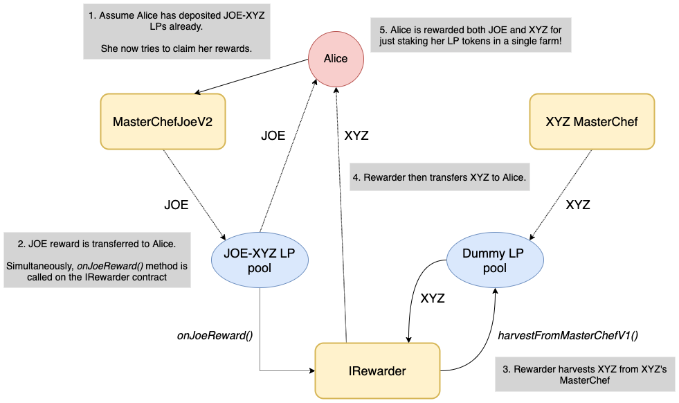

# MasterChefJoeV2 and Double Reward Farms

MasterChefJoeV2 is a modified version of Sushi's MasterChefV2, which allows farms to offer two rewards instead of one.

For example, instead of just rewarding JOE, it has the ability to offer JOE **and** your project's token.

## How It Works

The only thing you need to get this to work with MasterChefJoeV2 is to implement a contract that conforms to the IRewarder interface.

This interface describes two functions:

```sol
interface IRewarder {
  using SafeERC20 for IERC20;

  function onJoeReward(address user, uint256 newLpAmount) external;

  function pendingTokens(address user) external view returns (uint256 pending);
}

```

`pendingTokens` is purely for displaying stats on the frontend.

The most important is `onJoeReward`, which is called whenever a user harvests from our MasterChefJoeV2.

It is in this function where you would want to contain the logic to mint/transfer your project's tokens to the user.

The implementation is completely up to you and it is does not matter if your tokens are minted per block or per second - either will work.

But to make your life easier, we have implemented two types of rewarders: a simple version and a version if your project also uses a Sushi-style masterchef.

Both types come in per block or per second:

- [contracts/rewarders/SimpleRewarderPerBlock.sol](contracts/rewarders/SimpleRewarderPerBlock.sol)
- [contracts/rewarders/SimpleRewarderPerSec.sol](contracts/rewarders/SimpleRewarderPerSec.sol) (recommended)
- [contracts/rewarders/MasterChefRewarderPerBlock.sol](contracts/rewarders/MasterChefRewarderPerBlock.sol)
- [contract/rewarders/MasterChefRewarderPerSec.sol](contract/rewarders/MasterChefRewarderPerSec.sol)

## Example: Simple Rewarder (recommended)

- [contracts/rewarders/SimpleRewarderPerBlock.sol](contracts/rewarders/SimpleRewarderPerBlock.sol)
- [contracts/rewarders/SimpleRewarderPerSec.sol](contracts/rewarders/SimpleRewarderPerSec.sol)

This is the version we recommend simply because it's the easiest and less prone to accidental failures.

The concept is simple: a fixed amount of reward tokens is transferred to the contract prior. Then our masterchef will
distribute it according to the reward rate set on it. This requires no coordination with your own masterchef whatsoever.

Key points:

- Easy setup, no coordination with your masterchef.
- Needs to be funded with your reward tokens beforehand.
- Once the rewarder is funded with your reward tokens, there is **no** way to get them back.

Setup:

1. The rewarder contract is deployed.
2. A fixed amount of your token is transferred to the contract.
3. The reward rate is set on the rewarder contract.
4. The rewarder contract is added to the pool on our MasterChefJoeV2.
5. Users will now be able to claim double rewards when they start staking.

To stop:

1. Set reward rate on rewarder contract to 0.

## Example: MasterChef Rewarder

- [contracts/rewarders/MasterChefRewarderPerBlock.sol](contracts/rewarders/MasterChefRewarderPerBlock.sol)
- [contract/rewarders/MasterChefRewarderPerSec.sol](contract/rewarders/MasterChefRewarderPerSec.sol)

This is only applicable if your project uses a Sushi-style MasterChef contract.

Even if it does, we still recommend the Simple Rewarder. But in some cases, your project may not be able to pre-fund the rewarder.
In this case, the MasterChef Rewarder is suitable.



It works by creating a proxy pool in your own MasterChef using a dummy token, which the MasterChef Rewarder contract deposits in order
to receive your reward tokens. Once it harvests your reward tokens, it is then able to distribute them to the users.

Key points:

- Requires coordination with your masterchef.
- Does not need pre-funding beforehand.
- **Highly recommend** not to change any pool weights and/or add new pools in your MasterChef for the duration of the rewarder is live. If you do need to change any pool's weights
  or add new pools, please inform us as it requires coordination to ensure users don't under/over harvest rewards.

Setup:

1. Create a new dummy token, `DUMMY`, with supply of 1 (in Wei).
2. Transfer 1 `DUMMY` to the deployer and then renounce ownership of the token.
3. Create a new pool in your MasterChef for `DUMMY`.
4. Deploy the rewarder contract.
5. Approve the rewarder contract to spend 1 `DUMMY`.
6. Call the `init()` method in IRewarder contract, passing in the `DUMMY` token address - this will allow the rewarder to deposit the dummy token into your MasterChef and start receiving your rewards.
7. The rewarder contract is added to the pool on our MasterChefJoeV2.
8. Users will now be able to claim double rewards when they start staking.

To stop:

1. Set allocation point of dummy pool on your MasterChef to 0.
2. Call `updatePool` on rewarder contract.
3. Set reward rate on rewarder contract to 0.
4. Set allocation point on rewarder contract to 0.

## Security and Testing

None of these contracts are audited.

However, we have gone to extreme lengths to test every edge case possible. We implore you take a look at our test cases to be satisfied:

- [test/MasterChefJoeV2.test.ts](test/MasterChefJoeV2.test.ts)

A quick note about testing with timestamp: it's less predictable than testing with blocks so instead of asserting the reward is an exact amount, we assert it falls within a certain range.

**To run:**

```
yarn test test/MasterChefJoeV2.test.ts
```

**To run coverage:**

```
yarn test:coverage --testfiles "test/MasterChefJoeV2.test.ts"
```

**Coverage results:**

| File                               | Statements | Branches |
| ---------------------------------- | ---------- | -------- |
| MasterChefJoeV2.sol                | 100%       | 100%     |
| SimpleRewarderPerBlock.sol         | 100%       | 93.75%   |
| SimpleRewarerPerSec.sol            | 100%       | 93.75%   |
| MasterChefRewarderPerBlockMock.sol | 98.28%     | 90.91%   |
| MasterChefRewarderPerSecMock.sol   | 98.28%     | 90.91%   |

Notes:

- Rewarders have branches that are really hard to hit, hence why statements are not 100%.
- Same with the branches.
